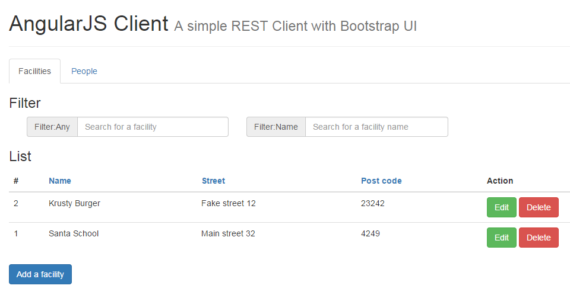

# AngularJS REST Client Demo

### Used software

JavaScript library

* [AngularJS](http://angularjs.org) (v.1.3.3)

CSS library

* [Bootstrap](http://getbootstrap.com) (v.3.3.1)

### Screenshots




## Getting started

### Requirements

* [node.js](http://nodejs.org/) is installed


### Installation

```sh
npm install
```

### Run

Run server :
```sh
node server.js
```

You can now open `http://localhost:3000/`